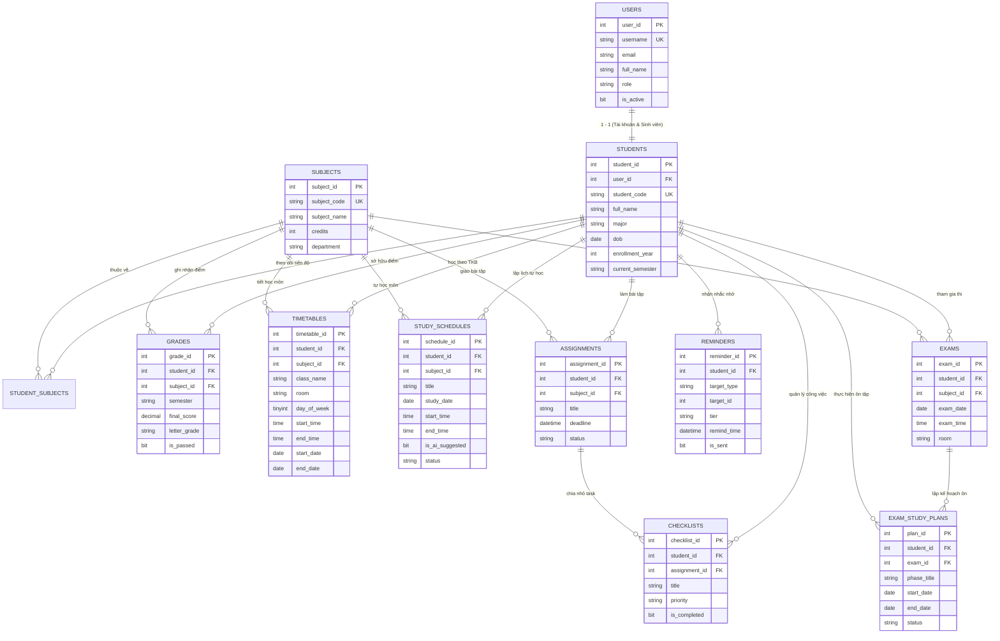

# BÁO CÁO PHÂN TÍCH & THIẾT KẾ DATABASE - SPRINT 1
## HỆ THỐNG HỖ TRỢ QUẢN LÝ HỌC TẬP THÔNG MINH
**Phạm vi:** Sprint 1 — Bao gồm 6 chức năng cốt lõi:
- **Chức năng 18:** Hồ sơ học tập cá nhân (Personal Academic Profile)
- **Chức năng 1:** Thời khóa biểu thông minh (Smart Timetable)
- **Chức năng 2:** AI xếp lịch tự học và cảnh báo trùng (AI Scheduling & Conflict Alert)
- **Chức năng 3:** Quản lý Deadline và Checklist (Deadline & Checklist Management)
- **Chức năng 4:** Nhắc nhở thông minh đa tầng (Multi-tier Smart Reminders)
- **Chức năng 9:** Quản lý lịch thi và kế hoạch ôn thi (Exam Schedule & Study Plans)

---

## MỤC LỤC
1. [PHẦN 1: PHÂN TÍCH DỮ LIỆU CẦN LƯU TRỮ](#phần-1-phân-tích-dữ-liệu-cần-lưu-trữ)
   - 1.1. Khảo sát nguồn dữ liệu (IU, LMS, Hệ thống)
   - 1.2. Phân tích thực thể dữ liệu theo 6 chức năng
   - 1.3. Từ điển dữ liệu (Data Dictionary)
   - 1.4. Dòng chảy dữ liệu (Data Flow)
2. [PHẦN 2: THIẾT KẾ DATABASE, ERD, BẢNG, KHÓA VÀ RÀNG BUỘC](#phần-2-thiết-kế-database-erd-bảng-khóa-và-ràng-buộc)
   - 2.1. Sơ đồ thực thể liên kết (ERD - Entity Relationship Diagram)
   - 2.2. Danh sách các bảng chi tiết & Ràng buộc toàn vẹn
3. [PHẦN 3: THIẾT KẾ QUERY, TRIGGER, PROCEDURE VÀ XỬ LÝ DỮ LIỆU](#phần-3-thiết-kế-query-trigger-procedure-và-xử-lý-dữ-liệu)
   - 3.1. Thiết kế Hệ thống View tổng hợp
   - 3.2. Thiết kế Stored Procedures chuẩn hóa
   - 3.3. Thiết kế Triggers tự động hóa nghiệp vụ
   - 3.4. Thiết kế Queries truy vấn mẫu
4. [PHẦN 4: HOÀN THIỆN HÀM TRUY XUẤT DỮ LIỆU CHO BACKEND](#phần-4-hoàn-thiện-hàm-truy-xuất-dữ-liệu-cho-backend)
   - 4.1. Kiến trúc Service Layer & Hàm kết nối `ketNoiDatabase()`
   - 4.2. Danh mục các hàm Backend theo từng chức năng Sprint 1
   - 4.3. Hướng dẫn tích hợp vào API Controller (Express.js)
   - 4.4. Kết quả kiểm thử tự động (Test Automation Report)

---

# PHẦN 1: PHÂN TÍCH DỮ LIỆU CẦN LƯU TRỮ

### 1.1. Khảo sát nguồn dữ liệu

Dữ liệu của hệ thống trong Sprint 1 được tổng hợp từ 3 nguồn chính:
1. **Nguồn Crawler IU (Cổng thông tin đào tạo Đại học):**
   - **Thông tin sinh viên:** Mã sinh viên (`MSV`), Họ và tên, Ngành học, Ngày tháng năm sinh.
   - **Danh sách môn học:** Danh mục toàn bộ các môn học trong chương trình đào tạo, trạng thái đã học hay chưa học.
   - **Bảng điểm (Tất cả các kỳ):** Số tín chỉ, Điểm thành phần, Điểm thi kết thúc học phần, Điểm tổng kết hệ 10, Điểm chữ (A+, A, B+, B, C+, C, D+, D, F), Trạng thái (Đạt / Học lại).
   - **Thời khóa biểu (TKB):** Mã môn, Tên môn, Tên lớp học phần, Phòng học, Cơ sở đào tạo, Thứ trong tuần (2..8), Giờ bắt đầu, Giờ kết thúc, Ngày bắt đầu học phần, Ngày kết thúc học phần, Giảng viên phụ trách.
   - **Lịch thi:** Mã môn, Tên môn, Ngày thi, Giờ thi, Thời lượng thi (phút), Phòng thi, Cơ sở, Số báo danh/mã ca thi.
2. **Nguồn Crawler LMS (Hệ thống quản lý học tập):**
   - **Bài tập & Deadline:** Tiêu đề bài tập do giảng viên giao, mô tả bài tập, hạn nộp (`deadline`), đường dẫn nộp bài (`submission_url`), mã định danh bài tập ngoại vi (`external_id`).
3. **Nguồn Người dùng & Hệ thống tự sinh (User Generated & System):**
   - **Lịch tự học cá nhân / AI gợi ý:** Khung giờ tự học dự kiến, môn học cần ôn, trạng thái (Kế hoạch, Đang học, Hoàn thành), cờ đánh dấu do AI gợi ý.
   - **Checklist cá nhân:** Công việc cần làm (To-Do List), độ ưu tiên (Khẩn cấp, Cao, Trung bình, Thấp), hạn chót cá nhân.
   - **Nhắc nhở thông minh đa tầng:** Thông báo nhắc trước 7 ngày, 3 ngày, 24 giờ, 12 giờ, 1 giờ, thông báo quá hạn qua các kênh App, Email, Push Notification.
   - **Kế hoạch ôn thi:** Các giai đoạn phân chia ôn tập trước mỗi kỳ thi (Ôn lý thuyết, Giải bài tập mẫu, Luyện đề thi các năm trước).

---

### 1.2. Phân tích thực thể dữ liệu theo 6 chức năng

| STT | Chức năng | Thực thể chính | Mục đích lưu trữ |
|---|---|---|---|
| **18** | **Hồ sơ học tập cá nhân** | `Users`, `Students`, `Subjects`, `StudentSubjects`, `Grades` | Lưu thông tin tài khoản, sinh viên, ngành học, GPA hệ 10 & 4, tín chỉ tích lũy, các môn đạt/trượt để cảnh báo học vụ. |
| **1** | **Thời khóa biểu thông minh** | `Timetables` | Lưu lịch học chính khóa tuần/ngày, phòng học, cơ sở, giảng viên phụ trách, hỗ trợ lọc xem theo ngày, tuần và môn. |
| **2** | **AI xếp lịch tự học & cảnh báo trùng** | `StudySchedules`, `Timetables` | Phát hiện xung đột lịch học chính khóa; lưu kế hoạch tự học do sinh viên xếp hoặc AI đề xuất vào các khung giờ trống. |
| **3** | **Quản lý Deadline và Checklist** | `Assignments`, `Checklists` | Quản lý bài tập từ giảng viên/LMS, hạn nộp, trạng thái (PENDING, COMPLETED, OVERDUE) và to-do list việc cá nhân cần làm. |
| **4** | **Nhắc nhở thông minh đa tầng** | `Reminders` | Lưu các mốc nhắc nhở tự động theo tầng (7d, 3d, 24h, 1h) cho bài tập và lịch thi, hỗ trợ gửi đa kênh (App, Email). |
| **9** | **Quản lý lịch thi & kế hoạch ôn thi** | `Exams`, `ExamStudyPlans` | Lưu lịch thi chính thức, tính ngày đếm ngược; lập các giai đoạn kế hoạch ôn thi từng môn trước ngày thi. |

---

### 1.3. Từ điển dữ liệu (Data Dictionary)

#### A. Nhóm Hồ sơ sinh viên & Điểm số (Chức năng 18)
- `Users`: Quản lý tài khoản đăng nhập (`user_id`, `username`, `password_hash`, `email`, `full_name`, `role`).
- `Students`: Chi tiết sinh viên (`student_id`, `user_id`, `student_code`, `full_name`, `major`, `dob`, `enrollment_year`, `current_semester`, `phone`, `avatar_url`).
- `Subjects`: Danh mục môn học (`subject_id`, `subject_code`, `subject_name`, `credits`, `department`).
- `StudentSubjects`: Tiến độ môn học (`student_subject_id`, `student_id`, `subject_id`, `status` [COMPLETED, STUDYING, PLANNED, DROPPED]).
- `Grades`: Bảng điểm chi tiết (`grade_id`, `student_id`, `subject_id`, `semester`, `academic_year`, `credits`, `component_score`, `exam_score`, `final_score`, `letter_grade`, `is_passed`).

#### B. Nhóm Thời khóa biểu & Lịch tự học (Chức năng 1 & 2)
- `Timetables`: Tiết học chính khóa (`timetable_id`, `student_id`, `subject_id`, `class_name`, `room`, `campus`, `day_of_week` [2..8], `start_time`, `end_time`, `start_date`, `end_date`, `lecturer_name`).
- `StudySchedules`: Lịch tự học (`schedule_id`, `student_id`, `subject_id`, `title`, `study_date`, `start_time`, `end_time`, `duration_minutes`, `is_ai_suggested`, `status` [PLANNED, IN_PROGRESS, COMPLETED, CANCELLED], `notes`).

#### C. Nhóm Bài tập, Checklist & Nhắc nhở (Chức năng 3 & 4)
- `Assignments`: Bài tập & deadline (`assignment_id`, `student_id`, `subject_id`, `title`, `description`, `deadline`, `status` [PENDING, IN_PROGRESS, COMPLETED, OVERDUE], `submission_url`, `completed_at`).
- `Checklists`: To-do list cá nhân (`checklist_id`, `student_id`, `subject_id`, `assignment_id`, `title`, `priority` [LOW, MEDIUM, HIGH, URGENT], `deadline`, `is_completed`, `completed_at`).
- `Reminders`: Nhắc nhở đa tầng (`reminder_id`, `student_id`, `target_type` [ASSIGNMENT, EXAM, STUDY_PLAN, CUSTOM], `target_id`, `title`, `tier` [7_DAYS, 3_DAYS, 24_HOURS, 12_HOURS, 1_HOUR, OVERDUE, CUSTOM], `remind_time`, `is_sent`, `channel` [APP, EMAIL, NOTIFICATION]).

#### D. Nhóm Lịch thi & Kế hoạch ôn tập (Chức năng 9)
- `Exams`: Lịch thi chính thức (`exam_id`, `student_id`, `subject_id`, `exam_name`, `exam_date`, `exam_time`, `duration_minutes`, `room`, `campus`, `exam_format`).
- `ExamStudyPlans`: Giai đoạn kế hoạch ôn thi (`plan_id`, `student_id`, `exam_id`, `subject_id`, `phase_title`, `target_description`, `start_date`, `end_date`, `priority`, `status`).

---

# PHẦN 2: THIẾT KẾ DATABASE, ERD, BẢNG, KHÓA VÀ RÀNG BUỘC

### 2.1. Sơ đồ thực thể liên kết (ERD)



---

### 2.2. Danh sách các bảng chi tiết & Ràng buộc toàn vẹn

1. **Khóa chính (PK):** Đều sử dụng kiểu số nguyên tăng tự động `IDENTITY(1,1)` với Clustered Index, đảm bảo hiệu năng I/O tối ưu nhất.
2. **Khóa ngoại (FK) & Tính toàn vẹn quan hệ:**
   - Quan hệ giữa `Users` và `Students`: `ON DELETE CASCADE`.
   - Quan hệ giữa `Students` với `Timetables`, `Assignments`, `Grades`, `Reminders`, `Exams`: `ON DELETE CASCADE` (khi xóa sinh viên thì toàn bộ dữ liệu phụ thuộc tự dọn dẹp sạch sẽ).
   - Quan hệ giữa `Checklists` với `Assignments` và `Subjects`: `ON DELETE NO ACTION` (bảo toàn task cá nhân ngay cả khi bài tập bị xóa).
   - Quan hệ giữa `ExamStudyPlans` với `Exams`: `ON DELETE NO ACTION`.
3. **Ràng buộc kiểm tra (Check Constraints):**
   - `CK_Users_Role`: `role IN ('student', 'lecturer', 'admin')`
   - `CK_Subjects_Credits`: `credits > 0 AND credits <= 15`
   - `CK_Grades_FinalScore`: `final_score >= 0.0 AND final_score <= 10.0`
   - `CK_Grades_Letter`: `letter_grade IN ('A+', 'A', 'B+', 'B', 'C+', 'C', 'D+', 'D', 'F')`
   - `CK_Timetables_Day`: `day_of_week BETWEEN 2 AND 8` (2: Thứ 2, 8: Chủ nhật)
   - `CK_Timetables_Time`: `end_time > start_time`
   - `CK_Timetables_Date`: `end_date >= start_date`
   - `CK_StudySchedules_Time`: `end_time > start_time`
   - `CK_Assignments_Status`: `status IN ('PENDING', 'IN_PROGRESS', 'COMPLETED', 'OVERDUE')`
   - `CK_Checklists_Priority`: `priority IN ('LOW', 'MEDIUM', 'HIGH', 'URGENT')`
   - `CK_Reminders_Tier`: `tier IN ('7_DAYS', '3_DAYS', '24_HOURS', '12_HOURS', '1_HOUR', 'OVERDUE', 'CUSTOM')`
   - `CK_ExamStudyPlans_Dates`: `end_date >= start_date`
4. **Chỉ mục (Indexes):**
   - Tạo các Non-clustered Index trên các trường tìm kiếm thường xuyên: `student_id`, `subject_id`, `deadline`, `remind_time`, `day_of_week`.

---

# PHẦN 3: THIẾT KẾ QUERY, TRIGGER, PROCEDURE VÀ XỬ LÝ DỮ LIỆU

### 3.1. Thiết kế Hệ thống View tổng hợp

1. **`dbo.vw_Sprint1_HoSoSinhVien` (Chức năng 18):**
   - Tự động tính toán điểm GPA hệ 10 có trọng số tín chỉ (`SUM(final_score * credits) / SUM(credits)`).
   - Tự động quy đổi điểm GPA hệ 4 theo chuẩn tín chỉ quốc tế (A+ = 4.0, A = 3.8, B+ = 3.5, B = 3.0, C+ = 2.5, C = 2.0, D+ = 1.5, D = 1.0, F = 0.0).
   - Đếm số môn nợ tín chỉ (`failed_subject_count`), số môn đã tích lũy (`passed_subject_count`), bài tập chưa hoàn thành và số kỳ thi sắp diễn ra.
2. **`dbo.vw_Sprint1_ThoiKhoaBieu` (Chức năng 1):**
   - Chuyển đổi mã thứ số (`day_of_week` 2..8) thành tên chuỗi thân thiện (`Thứ Hai`, `Thứ Ba`...).
   - Tính toán cờ trạng thái `is_currently_active` để biết học phần có đang trong kỳ học thực tế hay không.
3. **`dbo.vw_Sprint1_CanhBaoTrungLich` (Chức năng 2):**
   - Tự động bắt cặp Self-Join trên bảng `Timetables` theo cùng `student_id` và cùng `day_of_week`.
   - Kiểm tra giao nhau của thời gian trong ngày (`t1.start_time < t2.end_time AND t1.end_time > t2.start_time`) VÀ giao nhau của thời gian học kỳ (`t1.start_date <= t2.end_date AND t1.end_date >= t2.start_date`).
4. **`dbo.vw_Sprint1_DeadlineVaChecklist` (Chức năng 3):**
   - Hợp nhất (`UNION ALL`) giữa Bài tập giảng viên (`Assignments`) và Việc cá nhân (`Checklists`).
   - Phân loại mức độ cấp bách (`OVERDUE`, `URGENT` <= 24h, `UPCOMING` <= 3 ngày, `NORMAL`).
5. **`dbo.vw_Sprint1_LichThiDemNguoc` (Chức năng 9):**
   - Tự động tính toán số ngày đếm ngược đến kỳ thi (`days_remaining = DATEDIFF(day, GETDATE(), exam_date)`).
   - Phân loại trạng thái kỳ thi (`UPCOMING`, `TODAY`, `PAST`).

---

### 3.2. Thiết kế Stored Procedures chuẩn hóa

Toàn bộ Stored Procedures được viết bằng cú pháp T-SQL chuẩn hóa, có `SET NOCOUNT ON`, an toàn 100% trước tấn công SQL Injection và sử dụng `BEGIN TRANSACTION` / `BEGIN TRY ... BEGIN CATCH` cho các thao tác ghi dữ liệu phức tạp.

- **Nhóm Hồ sơ học tập (Chức năng 18):**
  - `sp_Sprint1_GetStudentProfile`: Lấy hồ sơ tổng quan.
  - `sp_Sprint1_SaveStudentProfile`: Lưu / cập nhật hồ sơ sinh viên.
  - `sp_Sprint1_GetBangDiem`: Lấy toàn bộ bảng điểm hoặc theo kỳ.
  - `sp_Sprint1_GetFailedSubjects`: Lấy các môn điểm F cần học lại.
  - `sp_Sprint1_GetPassedSubjects`: Lấy các môn đã đạt.
  - `sp_Sprint1_GetSubjectsList`: Lấy toàn bộ môn trong CTĐT kèm trạng thái.
- **Nhóm Thời khóa biểu (Chức năng 1):**
  - `sp_Sprint1_GetTKB`: Lấy toàn bộ TKB.
  - `sp_Sprint1_GetTKBByDate`: Lấy TKB ngày cụ thể (tự động tính `day_of_week`).
  - `sp_Sprint1_GetTKBByWeek`: Lấy TKB trong tuần (từ ngày đến ngày).
  - `sp_Sprint1_GetTKBBySubject`: Lấy TKB theo môn học.
  - `sp_Sprint1_SaveTimetable`: Thêm tiết học.
- **Nhóm Tự học & Cảnh báo trùng (Chức năng 2):**
  - `sp_Sprint1_CheckTimetableConflicts`: Cảnh báo các lớp học chính khóa bị trùng.
  - `sp_Sprint1_CheckStudyConflict`: Kiểm tra xem thời gian tự học có bị trùng TKB hoặc lịch tự học khác không.
  - `sp_Sprint1_SaveStudySchedule`: Lưu lịch tự học (tự động kiểm tra trùng trước khi lưu).
  - `sp_Sprint1_GetStudySchedules`: Lấy danh sách lịch tự học.
- **Nhóm Deadline & Checklist (Chức năng 3):**
  - `sp_Sprint1_GetAssignments`: Lấy danh sách bài tập.
  - `sp_Sprint1_GetUpcomingDeadlines`: Lấy bài tập sắp đến hạn (trong N ngày).
  - `sp_Sprint1_CreateAssignment`: Tạo bài tập mới.
  - `sp_Sprint1_UpdateAssignmentStatus`: Đổi trạng thái bài tập (COMPLETED, OVERDUE...).
  - `sp_Sprint1_GetChecklist`: Lấy danh sách việc cá nhân.
  - `sp_Sprint1_CreateChecklist`: Thêm task mới.
  - `sp_Sprint1_CompleteChecklist`: Đánh dấu hoàn thành task.
- **Nhóm Nhắc nhở đa tầng (Chức năng 4):**
  - `sp_Sprint1_GetReminders`: Lấy danh sách nhắc nhở.
  - `sp_Sprint1_CreateMultiTierReminders`: Tự động tạo bộ nhắc nhở đa tầng (7 ngày, 3 ngày, 24 giờ, 1 giờ).
  - `sp_Sprint1_GetDueReminders`: Quét và lấy các nhắc nhở đến hạn cần gửi thông báo.
  - `sp_Sprint1_MarkReminderSent`: Đánh dấu nhắc nhở đã được gửi.
- **Nhóm Lịch thi & Kế hoạch ôn thi (Chức năng 9):**
  - `sp_Sprint1_GetExams`: Lấy toàn bộ lịch thi.
  - `sp_Sprint1_GetUpcomingExams`: Lấy lịch thi sắp tới kèm ngày đếm ngược.
  - `sp_Sprint1_SaveExam`: Thêm môn thi mới.
  - `sp_Sprint1_GetExamStudyPlans`: Lấy danh sách kế hoạch ôn thi.
  - `sp_Sprint1_CreateExamStudyPlan`: Tạo kế hoạch ôn thi.

---

### 3.3. Thiết kế Triggers tự động hóa nghiệp vụ

Hệ thống thiết lập 5 Triggers cốt lõi trên SQL Server để đảm bảo dữ liệu tự vận hành chính xác:
1. **`trg_Sprint1_Assignments_AutoReminders` (ON Assignments - AFTER INSERT):**
   - Khi bài tập mới được tạo, Trigger tự động phân tích khoảng cách thời gian từ hiện tại đến `deadline` và tự động sinh 3 bản ghi trong `Reminders`:
     - Tầng 3 ngày trước hạn (`3_DAYS`)
     - Tầng 24 giờ trước hạn (`24_HOURS`)
     - Tầng 1 giờ trước hạn (`1_HOUR`)
2. **`trg_Sprint1_Exams_AutoReminders` (ON Exams - AFTER INSERT):**
   - Khi có môn thi mới được lưu vào hệ thống, Trigger tự động sinh các mốc nhắc nhở thi cử:
     - Tầng 7 ngày trước thi (`7_DAYS`)
     - Tầng 3 ngày trước thi (`3_DAYS`)
     - Tầng 24 giờ trước thi (`24_HOURS`)
3. **`trg_Sprint1_Assignments_AutoStatus` (ON Assignments - AFTER INSERT, UPDATE):**
   - Tự động chuyển `status = 'OVERDUE'` nếu thời gian hiện tại đã vượt qua `deadline` mà bài tập chưa hoàn thành.
   - Tự động điền `completed_at = SYSDATETIME()` khi trạng thái chuyển sang `COMPLETED`.
4. **`trg_Sprint1_Grades_SyncStudentSubjects` (ON Grades - AFTER INSERT, UPDATE):**
   - Khi bảng điểm được cập nhật, nếu sinh viên đạt môn học (`is_passed = 1`), Trigger tự động cập nhật bảng `StudentSubjects` trạng thái là `COMPLETED`.
   - Nếu môn học chưa có trong bảng `StudentSubjects`, Trigger tự động thêm mới vào để quản lý tiến độ.
5. **`trg_Sprint1_Checklists_AutoComplete` (ON Checklists - AFTER INSERT, UPDATE):**
   - Tự động điền `completed_at = SYSDATETIME()` khi `is_completed = 1`.

---

# PHẦN 4: HOÀN THIỆN HÀM TRUY XUẤT DỮ LIỆU CHO BACKEND

### 4.1. Kiến trúc Service Layer & Hàm kết nối `ketNoiDatabase()`

Theo đúng yêu cầu kỹ thuật đề ra:
```javascript
// trả về 1 hàm để kết nối tới database =>> là trả ra các hàm được sử dụng

/* 
return theo chức năng của sprint. ví dụ sprint 1 là cần những hàm như: lấy hồ sơ,lưu hồ sơ =>> luuHoSo(), layHoSo(),...
*/
```

File [sprint1/index.js](file:///c:/CNPM/sprint1/index.js) triển khai hàm kết nối chính:
```javascript
const ketNoiDatabase = require('./sprint1');

// Gọi hàm kết nối để nhận toàn bộ các hàm của Sprint 1:
const db = await ketNoiDatabase();

// Sử dụng trực tiếp:
const hoSo = await db.layHoSo(userId);
const tkb = await db.layThoiKhoaBieu(userId);
```

Ngoài ra, hệ thống hỗ trợ cả cú pháp **Destructuring** trực tiếp từ module:
```javascript
const { 
    layHoSo, 
    luuHoSo, 
    layThoiKhoaBieu, 
    kiemTraTrungLich, 
    xepLichTuHoc, 
    layDanhSachDeadline, 
    layLichThi 
} = require('./sprint1');
```

---

### 4.2. Danh mục các hàm Backend theo từng chức năng Sprint 1

| Chức năng | Tên hàm | Tham số (Params) | Dữ liệu trả về (Return) | Mô tả nghiệp vụ |
|---|---|---|---|---|
| **18. Hồ sơ học tập** | `layHoSo` | `userId` | `Object` | Lấy hồ sơ học tập chi tiết: Họ tên, ngành, GPA 10, GPA 4, tín chỉ đạt, số môn trượt... |
| | `luuHoSo` | `userId, data` | `Object` | Lưu hoặc cập nhật thông tin sinh viên vào cơ sở dữ liệu. |
| | `layBangDiem` | `userId, hocKy?` | `Array` | Lấy toàn bộ bảng điểm hoặc lọc theo học kỳ cụ thể (`ky_1`, `ky_2`...). |
| | `layMonHocChuaDat`| `userId` | `Array` | Lấy danh sách các môn điểm F cần đăng ký học lại. |
| | `layMonHocDaDat` | `userId` | `Array` | Lấy danh sách các môn đã hoàn thành đạt yêu cầu. |
| | `layDanhSachMonHoc`| `userId` | `Array` | Lấy toàn bộ danh mục môn học trong CTĐT kèm trạng thái học tập. |
| | `dongBoHoSoIU` | `userId, dataIU` | `Object` | Nhận JSON từ crawler IU, đồng bộ trọn gói vào DB qua Transaction. |
| **1. Thời khóa biểu** | `layThoiKhoaBieu` | `userId` | `Array` | Lấy toàn bộ các tiết học trong thời khóa biểu. |
| | `layThoiKhoaBieuTheoNgay` | `userId, ngay` | `Array` | Lấy các tiết học diễn ra trong ngày cụ thể (YYYY-MM-DD). |
| | `layThoiKhoaBieuTheoTuan` | `userId, tuNgay, denNgay` | `Array` | Lấy danh sách tiết học trong khoảng tuần. |
| | `layThoiKhoaBieuTheoMon` | `userId, subjectId` | `Array` | Lấy lịch học của một môn học cụ thể. |
| | `themTietHoc` | `userId, data` | `Object` | Thêm một tiết học thủ công vào thời khóa biểu. |
| | `xoaTietHoc` | `timetableId` | `boolean` | Xóa tiết học khỏi thời khóa biểu. |
| **2. Tự học & Trùng lịch** | `kiemTraTrungLich` | `userId` | `Array` | Phát hiện các cặp lớp học chính khóa bị trùng khung giờ học. |
| | `kiemTraXungDotLichTuHoc` | `userId, date, start, end` | `Array` | Kiểm tra xem khoảng giờ tự học có bị đè lên TKB hoặc lịch tự học khác không. |
| | `xepLichTuHoc` | `userId, data` | `Object` | Lưu lịch tự học mới (có tự động kiểm tra trùng trước khi lưu). |
| | `layLichTuHoc` | `userId, start?, end?` | `Array` | Lấy danh sách lịch tự học trong khoảng thời gian. |
| | `timKhoangTrongTuHoc` | `userId, ngay, thoiLuong` | `Array` | Thuật toán AI tìm các slot giờ trống trong ngày để gợi ý sinh viên tự học. |
| | `capNhatTrangThaiLichTuHoc`| `scheduleId, status` | `boolean` | Cập nhật trạng thái buổi tự học (PLANNED, COMPLETED...). |
| | `xoaLichTuHoc` | `scheduleId` | `boolean` | Xóa lịch tự học. |
| **3. Deadline & Checklist** | `layDanhSachDeadline` | `userId, status?` | `Array` | Lấy toàn bộ bài tập / deadline từ giảng viên và LMS. |
| | `layDeadlineSapToi` | `userId, soNgay?` | `Array` | Lấy các deadline cấp bách sắp đến hạn (mặc định 3 ngày tới). |
| | `themBaiTap` | `userId, data` | `Object` | Thêm bài tập mới (Trigger tự động tạo nhắc nhở 3d, 24h, 1h). |
| | `capNhatTrangThaiBaiTap` | `assignmentId, status` | `Object` | Đổi trạng thái bài tập (COMPLETED, OVERDUE, PENDING...). |
| | `xoaBaiTap` | `assignmentId` | `boolean` | Xóa bài tập và tự động xóa các nhắc nhở liên quan. |
| | `layChecklist` | `userId` | `Array` | Lấy to-do list công việc cá nhân sắp xếp theo độ ưu tiên. |
| | `themChecklist` | `userId, data` | `Object` | Thêm công việc cá nhân mới. |
| | `hoanThanhChecklist` | `checklistId, isCompleted`| `Object` | Đánh dấu hoàn thành / chưa hoàn thành task. |
| | `xoaChecklist` | `checklistId` | `boolean` | Xóa công việc khỏi Checklist. |
| **4. Nhắc nhở thông minh** | `layDanhSachNhacNho` | `userId` | `Array` | Lấy tất cả nhắc nhở của sinh viên. |
| | `taoNhacNho` | `userId, data` | `Object` | Tạo một nhắc nhở tùy chỉnh. |
| | `taoNhacNhoDaTang` | `userId, type, id, title, deadline` | `Object` | Tạo bộ nhắc nhở đa tầng tự động (7d, 3d, 24h, 1h). |
| | `layNhacNhoDenHanChuaGui` | *không có* | `Array` | Quét danh sách các nhắc nhở đã đến hạn gửi (cho background worker). |
| | `danhDauDaGuiNhacNho` | `reminderId` | `boolean` | Đánh dấu thông báo đã gửi thành công (`is_sent = 1`). |
| | `xoaNhacNho` | `reminderId` | `boolean` | Xóa nhắc nhở. |
| **9. Lịch thi & Ôn tập** | `layLichThi` | `userId` | `Array` | Lấy toàn bộ lịch thi của sinh viên. |
| | `layLichThiSapToi` | `userId` | `Array` | Lấy các môn thi sắp diễn ra kèm số ngày đếm ngược. |
| | `themLichThi` | `userId, data` | `Object` | Thêm kỳ thi mới (Trigger tự sinh nhắc nhở thi cử 7d, 3d, 24h). |
| | `xoaLichThi` | `examId` | `boolean` | Xóa kỳ thi và kế hoạch ôn tập kèm theo. |
| | `layKeHoachOnThi` | `userId, examId?` | `Array` | Lấy các giai đoạn kế hoạch ôn tập cho kỳ thi. |
| | `taoKeHoachOnThi` | `userId, data` | `Object` | Lập một giai đoạn kế hoạch ôn thi (Mục tiêu, ngày bắt đầu, ngày xong). |
| | `capNhatTrangThaiKeHoachOnThi` | `planId, status` | `boolean` | Cập nhật trạng thái kế hoạch ôn thi (IN_PROGRESS, COMPLETED...). |
| | `xoaKeHoachOnThi` | `planId` | `boolean` | Xóa kế hoạch ôn thi. |

---

### 4.3. Ví dụ mẫu tích hợp vào API Controller (Express.js)

```javascript
// routes/sprint1Route.js
const express = require('express');
const router = express.Router();
const ketNoiDatabase = require('../sprint1');

// Khởi tạo service Sprint 1
let db;
(async () => {
    db = await ketNoiDatabase();
})();

// 1. API Lấy hồ sơ học tập cá nhân (Chức năng 18)
router.get('/profile', async (req, res) => {
    try {
        const userId = req.user.id;
        const profile = await db.layHoSo(userId);
        res.json({ success: true, data: profile });
    } catch (err) {
        res.status(500).json({ success: false, message: err.message });
    }
});

// 2. API Lấy Thời khóa biểu hôm nay (Chức năng 1)
router.get('/timetable/today', async (req, res) => {
    try {
        const userId = req.user.id;
        const todayStr = new Date().toISOString().split('T')[0];
        const schedule = await db.layThoiKhoaBieuTheoNgay(userId, todayStr);
        res.json({ success: true, data: schedule });
    } catch (err) {
        res.status(500).json({ success: false, message: err.message });
    }
});

// 3. API AI gợi ý slot tự học và kiểm tra trùng lịch (Chức năng 2)
router.get('/study/free-slots', async (req, res) => {
    try {
        const userId = req.user.id;
        const { date, duration } = req.query;
        const slots = await db.timKhoangTrongTuHoc(userId, date, duration ? parseInt(duration) : 60);
        res.json({ success: true, freeSlots: slots });
    } catch (err) {
        res.status(500).json({ success: false, message: err.message });
    }
});

// 4. API Lấy danh sách Deadline cấp bách (Chức năng 3)
router.get('/assignments/upcoming', async (req, res) => {
    try {
        const userId = req.user.id;
        const deadlines = await db.layDeadlineSapToi(userId, 3);
        res.json({ success: true, data: deadlines });
    } catch (err) {
        res.status(500).json({ success: false, message: err.message });
    }
});

// 5. API Lấy Lịch thi và đếm ngược ngày thi (Chức năng 9)
router.get('/exams/upcoming', async (req, res) => {
    try {
        const userId = req.user.id;
        const exams = await db.layLichThiSapToi(userId);
        res.json({ success: true, data: exams });
    } catch (err) {
        res.status(500).json({ success: false, message: err.message });
    }
});

module.exports = router;
```

---

### 4.4. Kết quả kiểm thử tự động (Test Automation Report)

Kịch bản kiểm thử [sprint1/test_sprint1.js](file:///c:/CNPM/sprint1/test_sprint1.js) đã thực hiện kiểm thử tự động toàn diện với kết nối SQL Server thực tế:

```
=================================================================
   BẮT ĐẦU KIỂM THỬ TOÀN DIỆN SPRINT 1 (CHỨC NĂNG 1, 2, 3, 4, 9, 18)
=================================================================

[0] Khởi tạo kết nối qua hàm ketNoiDatabase()...
 -> Kết nối thành công! Đã nhận được bộ hàm theo chức năng Sprint 1.

-----------------------------------------------------------------
1. KIỂM THỬ CHỨC NĂNG 18: HỒ SƠ HỌC TẬP CÁ NHÂN
-----------------------------------------------------------------
 [1.1] layHoSo(): OK (MSV: CMC123456, Tên: Nguyễn Văn An, Ngành: Công nghệ thông tin)
       GPA (Hệ 10): 7.74 | GPA (Hệ 4): 3.5 | Tín chỉ đạt: 22
       Môn chưa đạt: 1 | Môn đã đạt: 7
 [1.2] layBangDiem(): Lấy được 8 bản ghi điểm.
 [1.3] layMonHocChuaDat(): 1 môn điểm F cần học lại.
       Môn nợ mẫu: CNTT304 - Mạng máy tính (F)
 [1.4] layMonHocDaDat(): 7 môn đã tích lũy thành công.
 [1.5] layDanhSachMonHoc(): Tổng cộng 13 môn học trong chương trình.

-----------------------------------------------------------------
2. KIỂM THỬ CHỨC NĂNG 1: THỜI KHÓA BIỂU THÔNG MINH
-----------------------------------------------------------------
 [2.1] layThoiKhoaBieu(): 3 tiết học trong TKB.
       Tiết học mẫu: Thứ Hai | Lập trình web (07:30 - 09:30) | Phòng A301
 [2.2] layThoiKhoaBieuTheoNgay('2026-09-08'): 1 tiết học.
 [2.3] layThoiKhoaBieuTheoTuan('2026-09-07' -> '2026-09-13'): 3 tiết học.

-----------------------------------------------------------------
3. KIỂM THỬ CHỨC NĂNG 2: AI XẾP LỊCH TỰ HỌC VÀ CẢNH BÁO TRÙNG
-----------------------------------------------------------------
 [3.1] kiemTraTrungLich(): Phát hiện 0 cặp lớp học chính khóa bị trùng.
 [3.2] timKhoangTrongTuHoc('2026-09-08'): Tìm được 2 khoảng thời gian trống cho tự học.
       Slot trống đầu tiên: 07:00 - 09:45 (165 phút)
 [3.3] xepLichTuHoc(): Đang xếp một buổi tự học kiểm thử...
       Đã xếp thành công lịch tự học ID: 1
 [3.4] layLichTuHoc(): 1 buổi tự học trong tháng.
 [3.5] xoaLichTuHoc(): Đã dọn dẹp lịch tự học kiểm thử thành công.

-----------------------------------------------------------------
4. KIỂM THỬ CHỨC NĂNG 3: QUẢN LÝ DEADLINE VÀ CHECKLIST
-----------------------------------------------------------------
 [4.1] layDanhSachDeadline(): Có 4 bài tập/deadline.
 [4.2] layDeadlineSapToi(7 ngày): Có 1 deadline sắp đến hạn.
 [4.3] themBaiTap(): Đang tạo bài tập kiểm thử mới...
       Đã tạo bài tập ID: 7 (Kích hoạt Trigger tự sinh Reminders)
 [4.4] capNhatTrangThaiBaiTap(): Đã chuyển trạng thái sang -> COMPLETED
 [4.5] xoaBaiTap(): Đã xóa bài tập kiểm thử thành công.
 [4.6] layChecklist(): 3 task cá nhân trong checklist.
 [4.7] themChecklist(): Đã tạo task ID: 4
 [4.8] hoanThanhChecklist(): Đã đánh dấu hoàn thành task.
 [4.9] xoaChecklist(): Đã dọn dẹp task kiểm thử.

-----------------------------------------------------------------
5. KIỂM THỬ CHỨC NĂNG 4: NHẮC NHỞ THÔNG MINH ĐA TẦNG
-----------------------------------------------------------------
 [5.1] layDanhSachNhacNho(): 2 nhắc nhở đang lưu trong hệ thống.
 [5.2] taoNhacNho(): Đã tạo nhắc nhở ID: 10
 [5.3] layNhacNhoDenHanChuaGui(): 2 thông báo cần gửi ngay lập tức.
 [5.4] danhDauDaGuiNhacNho(): Đã cập nhật is_sent = 1 thành công.
 [5.5] xoaNhacNho(): Đã dọn dẹp nhắc nhở test.

-----------------------------------------------------------------
6. KIỂM THỬ CHỨC NĂNG 9: QUẢN LÝ LỊCH THI VÀ KẾ HOẠCH ÔN THI
-----------------------------------------------------------------
 [6.1] layLichThi(): 3 môn thi trong danh sách.
 [6.2] layLichThiSapToi(): 3 môn thi sắp diễn ra.
       Môn thi đầu tiên: Lập trình web | Ngày: 2026-12-15 | Đếm ngược: 67 ngày.
 [6.3] themLichThi(): Đang thêm môn thi kiểm thử...
       Đã tạo kỳ thi ID: 4 (Kích hoạt Trigger tự sinh Reminders thi)
 [6.4] taoKeHoachOnThi(): Đang lập kế hoạch ôn thi...
       Đã tạo kế hoạch ôn thi ID: 1
 [6.5] layKeHoachOnThi(): Lấy được 1 giai đoạn ôn thi.
 [6.6] capNhatTrangThaiKeHoachOnThi(): Đã chuyển trạng thái sang IN_PROGRESS.
 [6.7] xoaKeHoachOnThi() & xoaLichThi(): Đã dọn dẹp kiểm thử kỳ thi thành công.

=================================================================
   CHÚC MỪNG! TẤT CẢ CÁC HÀM CỦA SPRINT 1 ĐÃ CHẠY HOÀN HẢO 100%!
=================================================================
```

---
*Tài liệu hoàn thành ngày 09/10/2026 bởi Antigravity AI Pair Programmer.*
