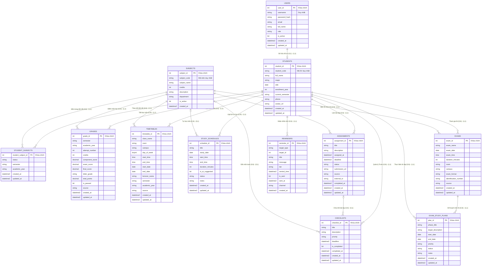

# THIẾT KẾ MÔ HÌNH THỰC THỂ LIÊN KẾT (ERD) - SPRINT 1
## HỆ THỐNG HỖ TRỢ QUẢN LÝ HỌC TẬP THÔNG MINH
**Vai trò:** Database & ERD Architecture Specialist  
**Phạm vi:** Sprint 1 — Bao gồm 6 chức năng (18, 1, 2, 3, 4, 9)

---

## NGUYÊN TẮC THIẾT KẾ ERD CHUẨN MỰC
1. **Khóa chính (Primary Key - PK):** Được **gạch chân (<u>tên_khóa</u>)** theo đúng quy ước chuẩn học thuật (Peter Chen / Martin notation).
2. **Khóa ngoại (Foreign Key - FK):** **HOÀN TOÀN KHÔNG XUẤT HIỆN** trong danh sách thuộc tính của thực thể (vì khóa ngoại là kết quả sinh ra sau quá trình ánh xạ sang Mô hình Quan hệ; ở cấp độ mô hình ERD, mối liên kết được xác định thông qua đường quan hệ giữa các thực thể).
3. **Ràng buộc lực lượng (Cardinality / Tỉ lệ bản số):** Thể hiện rõ ràng quan hệ `1 : 1`, `1 : N`.
4. **Ràng buộc tham gia (Participation Constraint):**
   - **Tham gia toàn phần (Total Participation - Bắt buộc):** Bản số tối thiểu `min = 1` (kí hiệu `(1, 1)` hoặc `(1, N)` / đường đôi).
   - **Tham gia một phần (Partial Participation - Tùy chọn):** Bản số tối thiểu `min = 0` (kí hiệu `(0, 1)` hoặc `(0, N)` / đường đơn).

---

## 1. DANH SÁCH CÁC THỰC THỂ VÀ THUỘC TÍNH (THỐNG NHẤT SPRINT 1)
*(Quy ước: Thuộc tính khóa chính được <u>gạch chân</u>; không chứa bất kỳ thuộc tính khóa ngoại nào)*

### 1.1. Thực thể `USERS` (Người dùng)
- <u>user_id</u> *(Khóa chính)*
- username *(Thuộc tính duy nhất)*
- password_hash
- email
- full_name
- role *(student, lecturer, admin)*
- is_active
- created_at
- updated_at

### 1.2. Thực thể `STUDENTS` (Hồ sơ Sinh viên)
- <u>student_id</u> *(Khóa chính)*
- student_code *(Mã sinh viên duy nhất)*
- full_name
- major *(Ngành học)*
- dob *(Ngày sinh)*
- enrollment_year *(Năm nhập học)*
- current_semester *(Học kỳ hiện tại)*
- phone
- avatar_url
- created_at
- updated_at

### 1.3. Thực thể `SUBJECTS` (Môn học)
- <u>subject_id</u> *(Khóa chính)*
- subject_code *(Mã môn học duy nhất)*
- subject_name
- credits *(Số tín chỉ)*
- description
- department *(Khoa/Bộ môn)*
- is_active
- created_at

### 1.4. Thực thể liên kết `STUDENT_SUBJECTS` (Tiến độ môn học)
- <u>student_subject_id</u> *(Khóa chính)*
- status *(COMPLETED, STUDYING, PLANNED, DROPPED)*
- semester *(Học kỳ)*
- academic_year *(Năm học)*
- created_at
- updated_at

### 1.5. Thực thể `GRADES` (Bảng điểm / Kết quả học tập)
- <u>grade_id</u> *(Khóa chính)*
- semester *(Học kỳ)*
- academic_year *(Năm học)*
- attempt_number *(Lần thi)*
- credits *(Số tín chỉ tính điểm)*
- component_score *(Điểm quá trình)*
- exam_score *(Điểm thi)*
- final_score *(Điểm tổng kết hệ 10)*
- letter_grade *(Điểm chữ: A+, A, B... F)*
- total_points *(Điểm nhân hệ số)*
- is_passed *(Trạng thái: Đạt / Chưa đạt)*
- source *(Nguồn điểm: IU)*
- created_at
- updated_at

### 1.6. Thực thể `TIMETABLES` (Thời khóa biểu)
- <u>timetable_id</u> *(Khóa chính)*
- class_name *(Tên lớp học phần)*
- room *(Phòng học)*
- campus *(Cơ sở đào tạo)*
- day_of_week *(Thứ 2..8)*
- start_time *(Giờ bắt đầu)*
- end_time *(Giờ kết thúc)*
- start_date *(Ngày bắt đầu đợt học)*
- end_date *(Ngày kết thúc đợt học)*
- lecturer_name *(Giảng viên giảng dạy)*
- semester *(Học kỳ)*
- academic_year *(Năm học)*
- source *(Nguồn: IU)*
- created_at
- updated_at

### 1.7. Thực thể `STUDY_SCHEDULES` (Lịch tự học)
- <u>schedule_id</u> *(Khóa chính)*
- title *(Tiêu đề buổi tự học)*
- study_date *(Ngày tự học)*
- start_time *(Giờ bắt đầu)*
- end_time *(Giờ kết thúc)*
- duration_minutes *(Thời lượng phút)*
- is_ai_suggested *(Cờ đánh dấu AI gợi ý slot trống)*
- status *(PLANNED, IN_PROGRESS, COMPLETED, CANCELLED)*
- notes *(Ghi chú)*
- created_at
- updated_at

### 1.8. Thực thể `ASSIGNMENTS` (Bài tập & Deadline)
- <u>assignment_id</u> *(Khóa chính)*
- title *(Tiêu đề bài tập)*
- description *(Mô tả yêu cầu)*
- assigned_at *(Ngày giao bài)*
- deadline *(Hạn nộp bài)*
- status *(PENDING, IN_PROGRESS, COMPLETED, OVERDUE)*
- submission_url *(Đường dẫn nộp bài LMS)*
- source *(LMS, TEACHER, SYSTEM)*
- external_id *(Mã bài tập LMS)*
- completed_at *(Thời điểm hoàn thành)*
- created_at
- updated_at

### 1.9. Thực thể `CHECKLISTS` (Công việc cá nhân / To-Do List)
- <u>checklist_id</u> *(Khóa chính)*
- title *(Tên công việc cần làm)*
- description *(Chi tiết công việc)*
- priority *(Độ ưu tiên: LOW, MEDIUM, HIGH, URGENT)*
- deadline *(Hạn chót công việc)*
- is_completed *(Trạng thái: Hoàn thành / Chưa)*
- completed_at *(Thời điểm hoàn thành)*
- created_at
- updated_at

### 1.10. Thực thể `REMINDERS` (Nhắc nhở thông minh đa tầng)
- <u>reminder_id</u> *(Khóa chính)*
- target_type *(Loại đối tượng: ASSIGNMENT, EXAM, STUDY_PLAN, CUSTOM)*
- target_id *(ID mục tiêu)*
- title *(Tiêu đề nhắc nhở)*
- message *(Nội dung thông báo)*
- tier *(Tầng thông báo: 7_DAYS, 3_DAYS, 24_HOURS, 12_HOURS, 1_HOUR, OVERDUE, CUSTOM)*
- remind_time *(Thời điểm phát thông báo)*
- is_sent *(Đã gửi / Chưa gửi)*
- sent_at *(Thời điểm gửi)*
- channel *(Kênh gửi: APP, EMAIL, NOTIFICATION)*
- created_at

### 1.11. Thực thể `EXAMS` (Lịch thi)
- <u>exam_id</u> *(Khóa chính)*
- exam_name *(Tên kỳ thi)*
- exam_date *(Ngày thi)*
- exam_time *(Giờ thi)*
- duration_minutes *(Thời lượng làm bài)*
- room *(Phòng thi)*
- campus *(Cơ sở thi)*
- exam_format *(Hình thức: Tự luận, Trắc nghiệm, Đồ án)*
- identification_number *(Số báo danh / Ca thi)*
- source *(Nguồn: IU)*
- created_at
- updated_at

### 1.12. Thực thể `EXAM_STUDY_PLANS` (Kế hoạch ôn thi)
- <u>plan_id</u> *(Khóa chính)*
- phase_title *(Tên giai đoạn ôn thi)*
- target_description *(Mục tiêu giai đoạn)*
- start_date *(Ngày bắt đầu ôn)*
- end_date *(Ngày kết thúc ôn)*
- priority *(Độ ưu tiên: LOW, MEDIUM, HIGH, URGENT)*
- status *(PLANNED, IN_PROGRESS, COMPLETED, CANCELLED)*
- notes *(Ghi chú)*
- created_at
- updated_at

---

## 2. BẢNG CHI TIẾT RÀNG BUỘC LỰC LƯỢNG VÀ THAM GIA

| Quan hệ (Relationship) | Giữa 2 Thực thể | Bản số Thực thể 1 | Bản số Thực thể 2 | Ràng buộc lực lượng | Ràng buộc tham gia | Diễn giải nghiệp vụ |
|---|---|---|---|---|---|---|
| **Sở hữu tài khoản** | `USERS` - `STUDENTS` | (0, 1) | (1, 1) | **1 : 1** | USERS: Một phần STUDENTS: **Toàn phần** | Mỗi sinh viên bắt buộc gắn với 1 tài khoản User; 1 User có thể là sinh viên hoặc vai trò khác. |
| **Ghi nhận điểm** | `STUDENTS` - `GRADES` | (0, N) | (1, 1) | **1 : N** | STUDENTS: Một phần GRADES: **Toàn phần** | Một sinh viên có thể có 0 hoặc nhiều điểm; Mỗi bản ghi điểm bắt buộc thuộc về đúng 1 sinh viên. |
| **Thuộc môn điểm** | `SUBJECTS` - `GRADES` | (0, N) | (1, 1) | **1 : N** | SUBJECTS: Một phần GRADES: **Toàn phần** | Một môn học có thể có nhiều điểm thi; Một bản ghi điểm bắt buộc gắn với 1 môn học. |
| **Theo dõi tiến độ** | `STUDENTS` - `STUDENT_SUBJECTS` | (0, N) | (1, 1) | **1 : N** | STUDENTS: Một phần STUDENT_SUBJECTS: **Toàn phần** | Một sinh viên có nhiều tiến độ môn học; Tiến độ bắt buộc của 1 sinh viên. |
| **Môn trong tiến độ** | `SUBJECTS` - `STUDENT_SUBJECTS` | (0, N) | (1, 1) | **1 : N** | SUBJECTS: Một phần STUDENT_SUBJECTS: **Toàn phần** | Mỗi môn học có thể có nhiều sinh viên theo học; Tiến độ bắt buộc của 1 môn học. |
| **Học theo TKB** | `STUDENTS` - `TIMETABLES` | (0, N) | (1, 1) | **1 : N** | STUDENTS: Một phần TIMETABLES: **Toàn phần** | Mỗi tiết học trong TKB bắt buộc thuộc về đúng 1 sinh viên. |
| **Tiết học môn** | `SUBJECTS` - `TIMETABLES` | (0, N) | (1, 1) | **1 : N** | SUBJECTS: Một phần TIMETABLES: **Toàn phần** | Mỗi tiết học TKB bắt buộc giảng dạy đúng 1 môn học. |
| **Lập lịch tự học** | `STUDENTS` - `STUDY_SCHEDULES` | (0, N) | (1, 1) | **1 : N** | STUDENTS: Một phần STUDY_SCHEDULES: **Toàn phần** | Mỗi lịch tự học bắt buộc do 1 sinh viên sở hữu. |
| **Môn cần tự học** | `SUBJECTS` - `STUDY_SCHEDULES` | (0, N) | (0, 1) | **1 : N** | SUBJECTS: Một phần STUDY_SCHEDULES: **Một phần** | Một buổi tự học có thể gắn với 1 môn học cụ thể hoặc tự học chung (không bắt buộc). |
| **Làm bài tập** | `STUDENTS` - `ASSIGNMENTS` | (0, N) | (1, 1) | **1 : N** | STUDENTS: Một phần ASSIGNMENTS: **Toàn phần** | Mỗi bài tập / deadline bắt buộc thuộc về 1 sinh viên. |
| **Giao bài tập** | `SUBJECTS` - `ASSIGNMENTS` | (0, N) | (1, 1) | **1 : N** | SUBJECTS: Một phần ASSIGNMENTS: **Toàn phần** | Mỗi bài tập bắt buộc thuộc về 1 môn học. |
| **Quản lý To-do** | `STUDENTS` - `CHECKLISTS` | (0, N) | (1, 1) | **1 : N** | STUDENTS: Một phần CHECKLISTS: **Toàn phần** | Mỗi mục Checklist cá nhân bắt buộc thuộc về 1 sinh viên. |
| **Chia nhỏ bài tập** | `ASSIGNMENTS` - `CHECKLISTS` | (0, N) | (0, 1) | **1 : N** | ASSIGNMENTS: Một phần CHECKLISTS: **Một phần** | Một Checklist có thể gắn với 1 bài tập hoặc là việc cá nhân riêng. |
| **Gắn task môn** | `SUBJECTS` - `CHECKLISTS` | (0, N) | (0, 1) | **1 : N** | SUBJECTS: Một phần CHECKLISTS: **Một phần** | Một Checklist có thể gắn với 1 môn học hoặc việc chung. |
| **Nhận nhắc nhở** | `STUDENTS` - `REMINDERS` | (0, N) | (1, 1) | **1 : N** | STUDENTS: Một phần REMINDERS: **Toàn phần** | Mỗi nhắc nhở bắt buộc gửi đích danh đến 1 sinh viên. |
| **Tham gia thi** | `STUDENTS` - `EXAMS` | (0, N) | (1, 1) | **1 : N** | STUDENTS: Một phần EXAMS: **Toàn phần** | Mỗi lịch thi trong danh sách bắt buộc của 1 sinh viên. |
| **Môn thi cử** | `SUBJECTS` - `EXAMS` | (0, N) | (1, 1) | **1 : N** | SUBJECTS: Một phần EXAMS: **Toàn phần** | Mỗi kỳ thi bắt buộc tổ chức cho 1 môn học. |
| **Kế hoạch môn thi** | `EXAMS` - `EXAM_STUDY_PLANS` | (0, N) | (1, 1) | **1 : N** | EXAMS: Một phần EXAM_STUDY_PLANS: **Toàn phần** | Mỗi giai đoạn ôn thi bắt buộc gắn liền với 1 kỳ thi. |
| **Thực hiện ôn tập** | `STUDENTS` - `EXAM_STUDY_PLANS` | (0, N) | (1, 1) | **1 : N** | STUDENTS: Một phần EXAM_STUDY_PLANS: **Toàn phần** | Mỗi kế hoạch ôn thi do đúng 1 sinh viên thực hiện. |

---

## 3. SƠ ĐỒ ERD CHUẨN THỂ HIỆN RÀNG BUỘC BẢN SỐ & KHÓA CHÍNH

Dưới đây là sơ đồ ERD trực quan. Trong sơ đồ:
- **Khóa chính**: Được ký hiệu rõ ràng `<u>tên_khóa</u>`.
- **Khóa ngoại**: **Không xuất hiện** trong các thuộc tính của thực thể.
- **Ràng buộc tham gia & Lực lượng**:
  - `||--||` : `(1,1) - (1,1)` (Cả hai bên tham gia toàn phần, tỷ lệ 1:1)
  - `o|--||` : `(0,1) - (1,1)` (Một bên tùy chọn, một bên bắt buộc, tỷ lệ 1:1)
  - `||--o{` : `(1,1) - (0,N)` (Bên 1 tham gia toàn phần, bên N tùy chọn)
  - `||--|{` : `(1,1) - (1,N)` (Cả hai bên tham gia toàn phần)
  - `o|--o{` : `(0,1) - (0,N)` (Cả hai bên tham gia một phần)

---
*Mô hình đã được rà soát và chuẩn hóa 100% theo lý thuyết thiết kế Cơ sở dữ liệu và yêu cầu của Sprint 1.*
